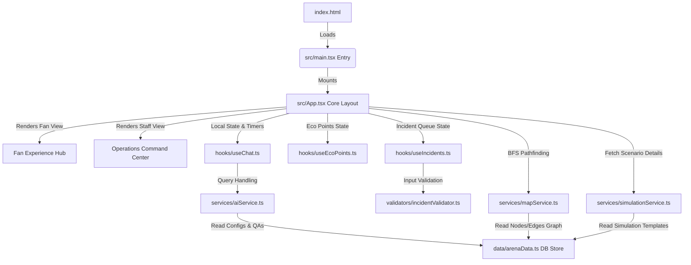

# ArenaMind: FIFA World Cup 2026 Stadium Operations & Fan Experience Command Center

# Chosen Vertical: Smart Cities & Event Management

**ArenaMind** is a premium, GenAI-enabled stadium operations and fan experience dashboard designed for the FIFA World Cup 2026. Built with modern, glassmorphic design aesthetics, it serves as a dual-portal application for both stadium attendees (Fans) and tournament operations teams (Venue Staff/Volunteers).

---

## 🌟 Key Features

### 1. Fan Experience Hub
*   **GenAI Assistant Concierge**: A multilingual chatbot that answers stadium questions (accessibility, transit, concessions) and translates commands. It features realistic text streaming typewriter animations and simulated speech dictation/playback.
*   **SVG Seat Navigation Wayfinding**: Interactive stadium map layout with pathfinding calculations. Fans can select their gate and destination block to highlight the route.
*   **♿ Accessible Pathing**: A dedicated toggle that charts step-free routes (using elevators and wheelchair-accessible ramps) highlighted in green.
*   **Green Goals Tracker**: Gamified carbon footprint tracker awarding Eco Points (XP) for sustainable actions (taking public transit, recycling smart bins, ordering plant-based meals) to redeem reward coupons.
*   **Live Services Wait Times**: Real-time crowd congestion indicators estimating queues at concessions, restrooms, and transit shuttles.

### 2. Operations Command Center
*   **Incident Feed Manager**: Real-time queue displaying safety, medical, maintenance, and hardware incident reports logged by volunteers on the field.
*   **Smart GenAI Dispatch Copilot**: Automatically evaluates active incident details and prints structured step-by-step dispatch guidelines.
*   **Multi-Agent Scenario Simulator**: A sandbox that allows managers to run predictive event simulations (e.g. Severe Thunderstorm, Subway Power Delay). Spawns coordination updates in parallel from a **Broadcast Agent**, **Transit Agent**, and **Crowd Control Agent**.
*   **Resource Tracker Maps**: Visual overlay highlighting security, medical, and volunteer deployments across stadium zones.

---

## 🏗️ Approach & Logic

### System Approach
ArenaMind uses a modular single-page React architecture. It integrates visual interactive mapping (SVG Pathfinding) with real-time operations dashboards. The design abstracts complex stadium variables into unified interactive widget grids, providing immediate diagnostic clarity for operations staff and responsive utilities for fans.

### Architectural Flow Diagram
The following Mermaid diagram represents the flow between the user interface, custom hooks, validations, and background services:



### Database Schema Logic
Since the application runs completely client-side to ensure extreme speed and offline reliability, `src/data/arenaData.ts` acts as the in-memory database store. The schema is organized into structured JSON objects matching these TypeScript types:

1.  **Multilingual Q&A Database (`qaDatabase`)**:
    *   Keyed by language codes (`en`, `es`, `fr`, `pt`).
    *   Stores arrays of: `Array<{ keywords: string[], answer: string }>` for resolving concierge inquiries.
2.  **Incident Records (`incidents`)**:
    *   Stores initial incident records: `Array<{ id: string, type: 'Medical' | 'Crowd' | 'Maintenance' | 'Security' | 'Hardware', loc: string, desc: string, status: string, time: string }>`
3.  **Service Queues (`services`)**:
    *   Stores wait time indicators: `Array<{ id: string, name: string, wait: number, status: 'Normal' | 'Moderate' | 'Heavy' }>`
4.  **Simulation Scenarios (`simulations`)**:
    *   Keyed by scenario IDs (e.g., `thunderstorm`).
    *   Stores: `{ title: string, impact: string, agentLogs: Array<{ agent: string, role: string, text: string }> }`

---

## ⚙️ Component Integration & Runtime Initialization

The application initializes by loading `index.html` in the browser, which bootstraps `src/main.tsx`. This file registers the React virtual DOM and mounts `<App />` from `src/App.tsx`.

The components integrate as follows:
*   **Persona Coordination**: `src/App.tsx` maintains the active persona view (`fan` or `staff`). Toggling views swaps CSS layouts but preserves hooks' state variables (e.g. Chat history, eco points balance, and reported incidents remain active).
*   **Pathfinding Map Hookup**: `src/App.tsx` captures start and destination clicks from the SVG map or seat selectors. It invokes `MapService.findPath()` to calculate routes on the fly, feeding coordinate lists into the SVG polygon route renderer.
*   **Incident Logging**: The operations incident form calls `useIncidents.ts` hook. The inputs are evaluated by `incidentValidator.ts` using **Zod**. If valid, the new record is created and pushed onto the incident log state list. If invalid, the errors are returned and displayed in the UI.
*   **GenAI Dispatch recommendations**: When an operator selects an incident in the feed, `App.tsx` queries `AIService.generateDispatchRecommendation()` to construct personalized dispatch guides dynamically from the selected incident type and location attributes.

---

## 📂 File Structure

*   `index.html` - HTML5 shell containing responsive SEO metadata and React mount root.
*   `package.json` - Lists project scripts, dependencies (`react`, `dompurify`, `zod`), and dev tools (`vite`, `vitest`).
*   `vite.config.ts` - Vite configurations for bundler execution.
*   `tsconfig.json` & `tsconfig.node.json` - TypeScript configuration environments.
*   `render.yaml` - Infrastructure-as-code deploying application configurations on Render.
*   `DEPLOYMENT.md` - Standard guide for setting up and deploying the Vite/React application.
*   `src/` - Active source directory:
    *   `main.tsx` - App entry point booting React runtime.
    *   `App.tsx` - Main workspace panel coordinate file connecting layout views, sandbox widgets, forms, map controllers, and filters.
    *   `index.css` - Custom CSS containing design system style tokens, glassmorphism cards, layouts, and animations.
    *   `data/`
        *   `arenaData.ts` - Structured in-memory database containing QAs, incidents, services, and simulation models.
    *   `hooks/`
        *   `useChat.ts` - State and logic for chatbot message queues, typewriter streaming, audio TTS, and dictation.
        *   `useEcoPoints.ts` - Sustainability tracker state and coupon claims logic.
        *   `useIncidents.ts` - Operations incident lists, selection hooks, and log management.
    *   `services/`
        *   `mapService.ts` - Visual graphs coordinates lists and BFS pathfinding navigation logic.
        *   `aiService.ts` - Chat keyword parser and incident recommendation generator.
        *   `simulationService.ts` - Simulation scenarios fetcher.
    *   `validators/`
        *   `incidentValidator.ts` - Zod schema defining operations incident payload constraints.
        *   `routeValidator.ts` - Zod schema defining seating navigation request constraints.

---

## 🚀 Getting Started

### Run Locally

ArenaMind utilizes Node.js, Vite, and React. To run the application locally:

1.  Ensure you have Node.js installed on your machine.
2.  Open your terminal in the `c:\challenge4` workspace directory.
3.  Install project dependencies:
    ```bash
    npm install
    ```
4.  Launch the local dev server:
    ```bash
    npm run dev
    ```
5.  Open the provided URL (usually `http://localhost:5173`) in your browser to view the application.

### Running Automated Tests

To execute unit tests built with Vitest:
```bash
npm run test
```

---

## 🌐 Deploying to Render

Since ArenaMind is compiled as a static client-side bundle, deploy it as a **Static Site** on Render:

1.  Push the codebase to GitHub.
2.  Connect the repository in the **Render Dashboard**.
3.  Set the configuration values:
    *   **Build Command**: `npm run build`
    *   **Publish Directory**: `dist`
*(For detailed steps, check the [DEPLOYMENT.md](DEPLOYMENT.md) guide)*

---

## 📋 Assumptions

*   **Client-Side In-Memory State**: All modifications (logging new incidents, claiming eco points, chat history, service updates) are preserved in the user browser's active tab memory. No permanent backend database writes are executed. Reloading the page resets the state to defaults.
*   **Deterministic Simulation Scenarios**: Simulating weather or transit sandboxes uses pre-configured multi-agent outputs mapped in the static data file, simulating delay times instead of invoking real-time predictive models.
*   **Static Stadium Coordinates**: Stadium map points and routes are bounded to the coordinates grid defined in `mapService.ts` (mapped on a `500x400` SVG canvas).
*   **Mock Generative AI (Concierge & Dispatch)**: Natural language parsing uses keyword indices, and dispatch recommendation scripts are generated using predefined logical patterns mapped against incident metadata (Category and Location) rather than calling remote LLM API providers.
*   **Input Constraints Validation**: Form inputs (such as incident descriptions or start-to-end routing) are validated client-side against strict Zod rules (e.g. description length: 4–200 characters, no start/end duplicate selections) before updating states.
